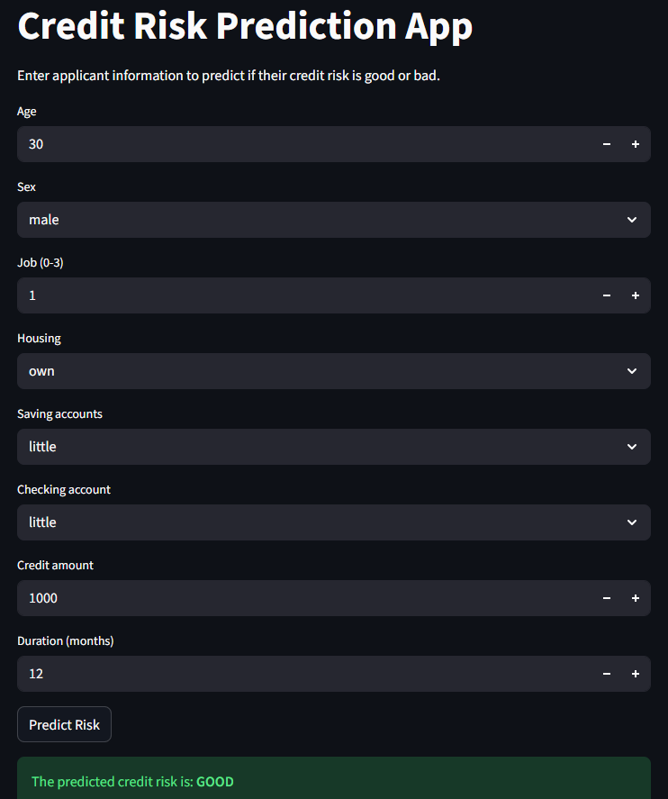

## 📸 App Preview



# 💳 Credit Risk Prediction App

A machine learning application that predicts the likelihood of a borrower defaulting on a loan, built using a real-world Kaggle dataset. The project covers the full data science workflow — from raw data exploration to a deployable prediction app.

---

## 🎯 Problem Statement

Credit risk assessment is one of the most critical functions in financial services. Lenders need a reliable, data-driven way to evaluate whether a borrower is likely to repay or default. This project builds a classification model to automate that prediction using historical German credit data.

---

## 🛠️ Tools & Stack

| Layer | Tool |
|---|---|
| Language | Python |
| Data Manipulation | Pandas, NumPy |
| Visualisation | Matplotlib, Seaborn |
| Machine Learning | Scikit-learn, XGBoost |
| Model Persistence | Joblib |
| Notebook Environment | Jupyter Notebook |
| Dataset Source | Kaggle — German Credit Data |

---

## 📁 Project Structure

```
credit-risk-prediction/
│
├── analysis_model.ipynb         # Full analysis notebook (EDA → model)
├── app.py                       # Prediction web app
├── german_credit_data.csv       # Source dataset
├── requirements.txt             # Dependencies
├── models/
│   ├── extra_trees_credit_model.pkl
│   ├── target_encoder.pkl
│   ├── Sex_label_encoder.pkl
│   ├── Housing_label_encoder.pkl
│   ├── Saving accounts_label_encoder.pkl
│   ├── Checking account_label_encoder.pkl
│   └── Purpose_label_encoder.pkl
└── README.md
```

---

## 🔄 Project Workflow

The full pipeline is documented in `analysis_model.ipynb` and follows these stages:

### 1. 📦 Data Collection
- Loaded the German Credit Dataset sourced from Kaggle (`german_credit_data.csv`)
- Dataset contains 1,000 borrower records across features including Age, Sex, Job, Housing, Saving Accounts, Checking Account, Credit Amount, Duration, Purpose, and Risk label

### 2. 🔍 Exploratory Data Analysis (EDA)
- Inspected dataset shape, data types, and summary statistics
- Analysed the target variable `Risk` distribution (Good vs Bad)
- Plotted histograms and box plots for numerical features: Age, Credit Amount, Duration
- Visualised distributions of all categorical features: Sex, Job, Housing, Saving Accounts, Checking Account, Purpose
- Generated a **correlation heatmap** across numerical features
- Key findings from EDA:
  - Individuals with **"own" housing** and **"rich" saving accounts** tend to be classified as good risk
  - **Older individuals** generally have higher credit amounts
  - Longer loan durations are associated with **higher default risk**
  - Average credit amount is higher among females than males
  - Skilled workers (Job code 2) have the highest average credit amounts

### 3. 🧹 Data Cleaning & Transformation
- Checked for and removed missing values using `dropna()`
- Confirmed zero duplicate records
- Dropped the unnamed index column
- Investigated high-duration outliers (loans ≥ 60 months)

### 4. ⚙️ Feature Engineering
- Selected 8 predictive features: `Age`, `Sex`, `Job`, `Housing`, `Saving accounts`, `Checking account`, `Credit amount`, `Duration`
- Applied **Label Encoding** to all categorical features using `LabelEncoder`
- Encoded the target variable `Risk` (good = 1, bad = 0)
- Saved all encoders as `.pkl` files for reuse in the prediction app
- Split data into training and test sets using an **80/20 split** with stratification to preserve class balance

### 5. 🤖 Model Building & Comparison
Four classification models were trained using **GridSearchCV** with 5-fold cross-validation to find the best hyperparameters for each:

| Model | Accuracy |
|---|---|
| XGBoost | 0.67 |
| **Extra Trees Classifier** ⬅ Selected | **0.64** |
| Random Forest | — |
| Decision Tree | — |

> XGBoost achieved the highest accuracy (0.67), but the **Extra Trees Classifier** was selected as the final model. Both models were tuned with GridSearchCV — Extra Trees offered strong, stable performance with balanced class weighting (`class_weight="balanced"`), making it well-suited for the class imbalance present in the dataset.

- The final trained model was saved as `extra_trees_credit_model.pkl` using Joblib

---

## 🖥️ Prediction App

The trained model is served through an interactive web app built in `app.py`. Users can input borrower details and receive an instant Good/Bad credit risk prediction.

To run the app:
```bash
streamlit run app.py
```

---

## ▶️ How to Run the Notebook

1. Clone the repository:
```bash
git clone https://github.com/imoh-solomonokon/Credit-Risk-Analysis.git
cd Credit-Risk-Analysis
```

2. Install dependencies:
```bash
pip install -r requirements.txt
```

3. Open the analysis notebook:
```bash
jupyter notebook analysis_model.ipynb
```

---

## 💡 Lessons Learned

- A higher accuracy model is not always the final choice — class imbalance handling, stability, and interpretability all factor into model selection
- EDA is the most time-intensive and insight-generating part of any real-world ML project
- GridSearchCV significantly improves model performance over default hyperparameters
- Saving encoders alongside the model is critical for consistent predictions in production

---

## 👤 Author

**Imoh Solomonokon**
[LinkedIn](https://linkedin.com/in/imohsolomonokon) • [GitHub](https://github.com/imoh-solomonokon)
